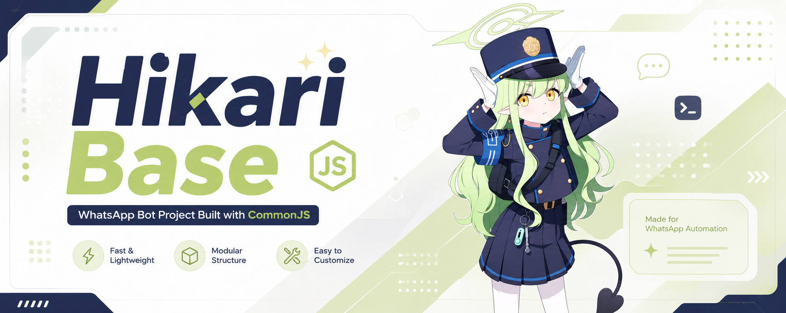
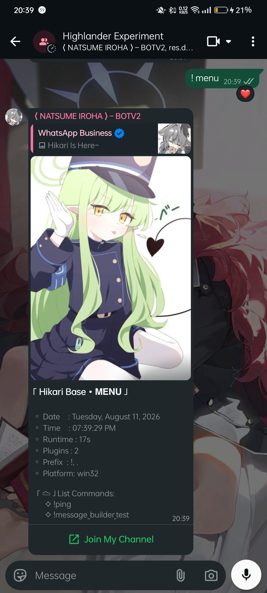

# Hikari-Base (CommonJs)



**Hikari-Base** is a ready-to-use and extensible WhatsApp bot base, allowing developers to focus on building features instead of dealing with connection handling, authentication, and other boilerplate setup.

<br>

## > About the Project Name

The name **Hikari-Base** is inspired by **Tachibana Hikari** from the game _Blue Archive_. This project uses the character's name solely as a source of inspiration for its identity and branding.

**Hikari-Base** is an independent, fan-made open-source project and is **not affiliated with, endorsed by, or sponsored by** Nexon Games, Yostar, or any other official parties associated with _Blue Archive_.

All rights to **Blue Archive**, including its characters, names, artwork, music, and other intellectual property, remain the property of their respective copyright owners. This repository does not claim ownership of any _Blue Archive_ intellectual property.

If you are the rightful copyright holder and believe that any content in this repository infringes upon your rights, please contact the maintainer so the issue can be reviewed and resolved appropriately.

<br>

## Preview

<div align="center">

</div>

<br>

<br>

## > Key Features

```
* Automatic Update Checker: Compares the local version against the latest release on GitHub and notifies you if an update is available.

* Powerful Interactive Messages: Powered by MessageBuilderV4.6, making it easy to send buttons, carousels, tables, syntax-highlighted code blocks, and many other interactive components.

* Lightweight & Database-Free: No .env, MySQL, or MongoDB required. Everything runs using memory or the local filesystem, making it ideal for low-cost VPS hosting or local development.

* Flexible & Reliable Login: Supports authentication via Pairing Code (phone number) or QR Code, with an intelligent auto-reconnect system.

* Smart Developer Experience: Includes Levenshtein distance fuzzy matching utilities to automatically detect and correct mistyped commands.

* Cross-Platform: Works on Termux, Windows, Linux, Pterodactyl panels, and more.
```

## > Quick Start

```bash
git clone https://github.com/dev-ryusei-hoshino/Hikari-Base
cd Hikari-Base
npm install
npm install sharp
npm start
```

For android/Termux:

```bash
git clone https://github.com/dev-ryusei-hoshino/Hikari-Base
cd Hikari-Base
npm install
npm install sharp @img/sharp-wasm32
npm start
```

> **Connection:** Enter your WhatsApp phone number in the terminal (format: `628...`), then enter the generated pairing code from **Linked Devices** in your WhatsApp application.

## > Command Example

All commands are defined in `lib/commands.js` using a `switch` statement. Each case receives a rich context object with sender role flags and a message helper.

```js
case <command>:
  try {
    // logic here
  } catch(e) {
    console.log(e);
    m.react("❌");
  };
  break;
```

> **Note:** Command names are auto-extracted from the `switch` statement in `lib/commands.js` (see `extractCaseNames()`) and displayed dynamically in the `!menu` output.

## > Configuration Example

```js
const packageFile = require("./package.json");

module.exports = {
  // false = Pairing Code, true = QR Code
  pairingWithQr: false,

  // Disable only if absolutely necessary
  ignore_self: true,

  markOnlineOnConnect: true,

  // Automatically mark incoming messages as read
  auto_read: true,

  bot: {
    name: "Hikari Base",
    slog: "Hikari Is Here~",
    ver: packageFile.version,

    thumb: "./lib/assets/thumb.jpeg",
    prefix: ["!", "$", "/"],

    owner: {
      number: "6285198221676",
      name: "Ryusei Hoshino",
    },
  },

  mess: {
    owner: "🚫 Access denied. This feature is restricted to the bot owner.",
    admin: "🚫 Access denied. Only group administrators can use this feature.",
    bot_not_admin: "⚠️ The bot must be an administrator to use this feature.",
    group: "⚠️ This feature can only be used in group chats.",
    private: "⚠️ This feature is only available in private chats.",
    premium:
      "🚫 Access denied. This feature is available to premium users only.",
    wait: "⏳ Processing your request...",
    plugin_not_available:
      "❌ Error: The requested plugin is currently unavailable.",
  },
};
```

## Project Structure

```
hikari-base/
├── config.js              # Bot configuration
├── hikari.js              # Entry point: connection, pairing, reconnection
├── package.json
├── README.md
├── node_modules/
└── lib/
    ├── handler.js         # Message receiving, parsing, context building
    ├── commands.js        # Command router (switch-based)
    └── utils/
        └── MessageBuilderV4.6.js  # Rich message builder library
```

## Architecture

### Message Flow

```
WhatsApp Web → Baileys Socket → messages.upsert → handleMessage() → runCommand() → Command Implementation → sendMessage()
```

### Handler Context Object

When a command is detected, `handler.js` constructs a context object (`ctx`) that is passed to `runCommand()`:

| Property     | Type                    | Description                                                                       |
| ------------ | ----------------------- | --------------------------------------------------------------------------------- |
| `conn`       | `WASocket`              | The active Baileys socket instance.                                               |
| `msg`        | `proto.IWebMessageInfo` | The raw message object.                                                           |
| `m`          | `object`                | A helper with `react(emoji)` and `reply(text)` methods bound to the current chat. |
| `botPfp`     | `string`                | The bot's profile picture URL.                                                    |
| `args`       | `string[]`              | Command arguments (split by whitespace).                                          |
| `isOwner`    | `boolean`               | `true` if the sender matches `config.bot.owner.number`.                           |
| `isAdmin`    | `boolean`               | `true` if the sender is a group admin (only in groups).                           |
| `isBotAdmin` | `boolean`               | `true` if the bot is a group admin (only in groups).                              |
| `senderName` | `string`                | The sender's display name.                                                        |
| `remoteJid`  | `string`                | The chat JID.                                                                     |
| `usedPrefix` | `string`                | The prefix that was used.                                                         |
| `command`    | `string`                | The lowercased command name.                                                      |

### Role Detection

- **Owner**: The sender's number is compared against `config.bot.owner.number`.
- **Admin**: In group chats, the handler fetches group metadata and checks the sender's participant record for `admin` or `superadmin` status.
- **Bot Admin**: Same metadata check, but for the bot's own JID.

### Session & Reconnection

Session credentials are persisted in `hikari_sessions/`. On a clean disconnect (status 401), the bot deletes this folder and requests a fresh pairing. Reconnection uses a 3-second delay with guard rails against overlapping attempts.

## Security Considerations

- **Session files**: Credentials are stored in `hikari_sessions/`. This directory should never be committed to version control.
- **Owner number**: The owner check relies on an exact string match of the sender's JID against `config.bot.owner.number`. Ensure the number matches exactly (digits only, no `+`, no leading `0`).
- **Self-message filtering**: `ignore_self: true` prevents loops from the bot's own messages. Disable with caution.

## Troubleshooting

| Problem                   | Solution                                                                                                       |
| ------------------------- | -------------------------------------------------------------------------------------------------------------- |
| Bot won't connect         | Verify `hikari_sessions/` is not corrupted. Delete the folder and restart.                                     |
| Pairing code not received | Ensure the phone number is in correct international format. Check WhatsApp server status.                      |
| Commands not recognized   | Verify the message starts with a configured prefix (`!` or `.`). Check bot is running.                         |
| Bot marked as spam        | Use a clean number. Avoid sending unsolicited bulk messages.                                                   |
| Update check fails        | The bot fetches `package.json` from GitHub on startup. Network issues won't block startup (errors are caught). |

## Credits & Attributions

This project is made possible thanks to various third-party resources, including libraries, assets, media, icons, and fonts. All rights belong to their respective creators and owners.

Special thanks to:

- **Node.js**
- **Baileys** (@whiskeysockets/baileys)
- **All Open Source Maintainers**
- **Asset Creators** whose work is used in this project
- **Everyone who has supported Hikari Base**

---

## Links & Contact

[**Repository**](https://github.com/dev-ryusei-hoshino/Hikari-Base)

[**WhatsApp Channel**](https://whatsapp.com/channel/0029VbDnVYyK0IBjO8RGfq3N)

[**Contact the Owner**](https://wa.me/6285198221676)

---

> **Important:** If you are the creator of any asset used in this project and wish to request proper crediting, updates, or removal, please contact the maintainer directly.
